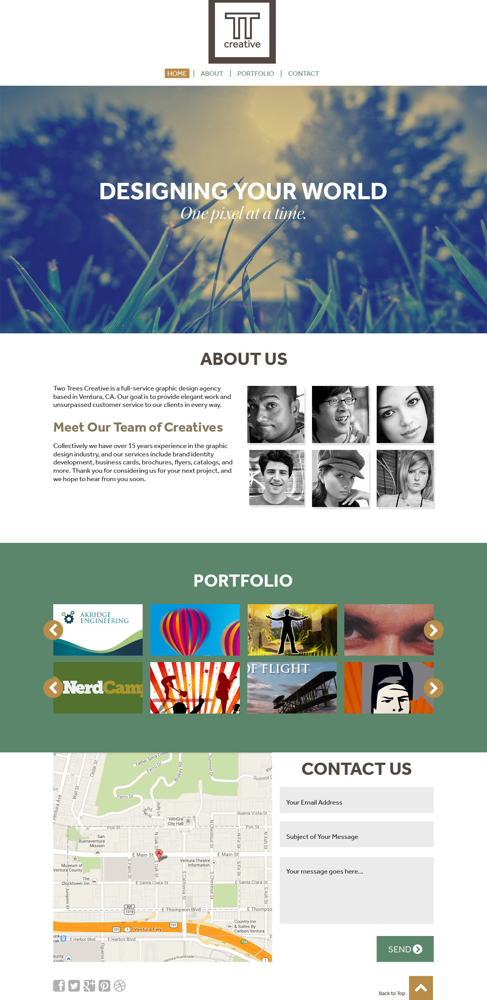

# TTCreative

In this class project, I attempted to replicate the design of a web page through only HTML and CSS to the best of my ability. The design was provided to me as part of
the assignment in my GIT 337 class at Arizona State University. This also applies to all of the image assets seen on the webpage. 

Below is the Web Design Mockup that I received as part of the assignment, and what I strove to replicate:

